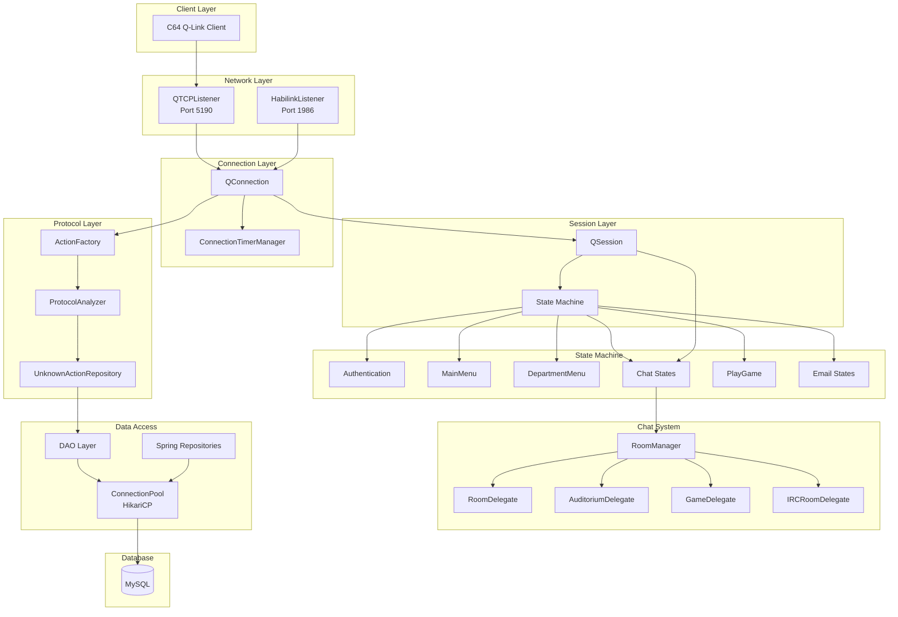
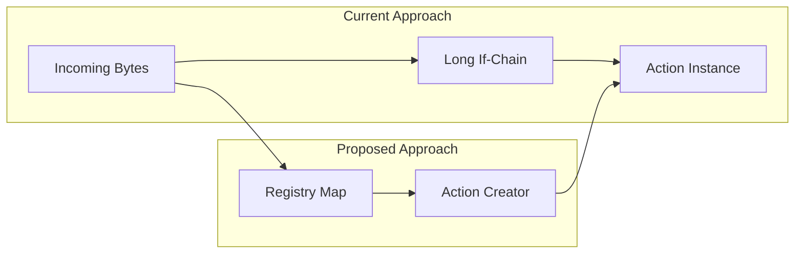

# Q-Link Reloaded - Design Review and Recommendations

> **Last Updated:** 2026-04-23
> **Review Scope:** Architecture, code quality, security, performance, testing, build/deployment
> **Status:** Validated against current codebase (v0.1.0)

## Executive Summary

Q-Link Reloaded is a Java server implementation that recreates the Q-Link (Quantum Link) online service for the Commodore 64. The project has undergone significant modernization efforts (Phase 1: Security, Phase 2: Protocol Analysis). This review covers architecture, code quality, optimization opportunities, and recommended next steps.

**Overall Assessment:** The project has a solid foundational architecture with good separation of concerns. The Docker infrastructure has been modernized successfully. The biggest remaining risks are the complete lack of automated testing and several code quality issues in core dispatch logic.

---

## 1. Project Architecture Overview

### Current Architecture

### Strengths
- **Clear Separation of Concerns**: Network, session, state, and data access layers are well-separated
- **State Machine Pattern**: Clean implementation using the State pattern for session lifecycle management
- **Connection Pooling**: Modern HikariCP implementation with proper configuration
- **Protocol Analysis Infrastructure**: Comprehensive system for capturing and analyzing unknown protocol messages
- **Concurrent Data Structures**: Uses `ConcurrentHashMap`, `CopyOnWriteArrayList` for thread safety

### Architecture Concerns

1. **Mixed Data Access Patterns**: The project has both traditional DAO classes (`AccountDAO`, `UserDAO`, etc.) AND Spring Data JPA repositories (`AccountRepository`, `UserRepository`). This creates confusion about which pattern to use for new features and duplicates functionality.

2. **Spring Configuration Without Spring Context**: [`SpringDataJpaConfig`](src/main/java/org/jbrain/qlink/db/config/SpringDataJpaConfig.java:47) defines Spring beans, but there's no evidence of a Spring Application Context being initialized in [`QLinkServer`](src/main/java/org/jbrain/qlink/QLinkServer.java:55). The Spring configuration may be dead code or not wired up.

3. **Singleton Anti-pattern**: Multiple singletons using non-thread-safe initialization (`ConnectionPool`, `RoomManager`, various DAOs). While some use `synchronized` blocks, others rely on lazy initialization without proper synchronization.

4. **Tight Coupling in State Classes**: State classes like [`DepartmentMenu`](src/main/java/org/jbrain/qlink/state/DepartmentMenu.java:81) directly depend on many DAOs, making them hard to test and maintain. At 28KB, this is also the largest single file.

---

## 2. Code Quality Analysis

### Action Factory - Code Smell
[`ActionFactory.newInstance()`](src/main/java/org/jbrain/qlink/cmd/action/ActionFactory.java:35) uses a long chain of if-statements (150+ lines) for action dispatching. This violates the Open/Closed Principle.

**Recommendation**: Replace with a Strategy/Registry pattern using a `Map<String, Supplier<Action>>` or enum-based dispatch.

### Duplicate Checks in ActionFactory
Lines 136-143 and 151-152 in [`ActionFactory`](src/main/java/org/jbrain/qlink/cmd/action/ActionFactory.java:136) have duplicate checks for `SendOLM` and `OM` mnemonics, meaning the second check is dead code.

### Test Code Left in Production
[`RoomManager`](src/main/java/org/jbrain/qlink/chat/RoomManager.java:58) contains dead loops (`for (int i = 1; i < 1; i++)`) that were apparently left for testing purposes. These should be removed.

### Inconsistent Logging Patterns
Some classes use static logger fields (`private static Logger _log`), while the naming convention mixes `_log` with other styles. Consider standardizing.

### Large Files Need Refactoring
- [`DepartmentMenu.java`](src/main/java/org/jbrain/qlink/state/DepartmentMenu.java:1) - 28KB, handles too many responsibilities
- [`AbstractMenuState.java`](src/main/java/org/jbrain/qlink/state/AbstractMenuState.java:1) - 10KB with complex menu navigation logic
- [`AbstractChatState.java`](src/main/java/org/jbrain/qlink/state/AbstractChatState.java:1) - 15KB with mixed chat concerns

### Magic Numbers and Strings
Protocol mnemonics are scattered as string literals throughout the codebase. While each Action class has a `MNEMONIC` constant, the factory still uses string comparisons.

---

## 3. Security Review

### Strengths (Phase 1 Modernization)
- Log4j upgraded from 1.x to 2.23.1 (addressing Log4Shell and related vulnerabilities)
- Input validation framework via [`SecurityUtils`](src/main/java/org/jbrain/qlink/util/SecurityUtils.java:39)
- SQL injection prevention with parameterized queries
- XSS detection patterns
- Directory traversal prevention in file handling

### Security Concerns

1. **Weak Random Number Generator**: [`SecurityUtils.generateSecureToken()`](src/main/java/org/jbrain/qlink/util/SecurityUtils.java:198) uses `java.util.Random` instead of `java.security.SecureRandom`. For security tokens, this is insufficient.

2. **SecurityUtils Not Widely Applied**: The validation utilities exist but may not be consistently applied across all entry points. The [`AbstractState.execute()`](src/main/java/org/jbrain/qlink/state/AbstractState.java:57) method handles actions without visible validation.

3. **Hardcoded Credentials in Spring Config**: [`SpringDataJpaConfig`](src/main/java/org/jbrain/qlink/db/config/SpringDataJpaConfig.java:59) has fallback credentials (`qlink`/`qlink`) which could be a risk if the config is not properly overridden.

4. **No Rate Limiting**: No evidence of rate limiting for connections, logins, or chat messages. A malicious client could flood the server.

5. **No Authentication/Authorization for Admin Commands**: The [`ProtocolCommand`](src/main/java/org/jbrain/qlink/cmd/action/ProtocolCommand.java:1) mentions staff privileges, but the enforcement mechanism needs verification.

6. **Static Mutable State**: Static fields like `RoomManager._htPrivateRooms` and `QLinkServer._iSessionCount` can be problematic in multi-instance deployments.

---

## 4. Optimization Opportunities

### Performance

1. **ActionFactory Lookup**: The linear if-chain in [`ActionFactory`](src/main/java/org/jbrain/qlink/cmd/action/ActionFactory.java:35) is O(n) for every incoming action. Replace with a HashMap for O(1) lookup.

2. **Database Query Optimization**: DAOs should use connection pooling effectively. Verify that connections are properly closed using try-with-resources in all DAO methods.

3. **String Concatenation in Loops**: Some older code may still use string concatenation in loops. Use `StringBuilder` for better performance.

4. **Memory Management**: The protocol capture system ([`ProtocolAnalyzer`](src/main/java/org/jbrain/qlink/protocol/ProtocolAnalyzer.java:1)) captures all traffic. Ensure captured data is bounded and purged periodically to prevent memory leaks.

### Resource Management

1. **Connection Pool Sizing**: Default max pool size is 10. Monitor actual usage and adjust based on expected concurrent users.

2. **Send Queue in QConnection**: [`QConnection._alSendQueue`](src/main/java/org/jbrain/qlink/connection/QConnection.java:73) uses `ArrayList` without bounds. Consider a bounded `ArrayBlockingQueue` to prevent memory issues during slow connections.

---

## 5. Testing Coverage

### Critical Gap: No Test Suite
The `src/test` directory is **completely empty**. This is the most significant finding of this review.

**Recommendations**:
1. Start with unit tests for critical utilities: [`SecurityUtils`](src/main/java/org/jbrain/qlink/util/SecurityUtils.java:1), [`DatabaseUtils`](src/main/java/org/jbrain/qlink/util/DatabaseUtils.java:1), [`CRC16`](src/main/java/org/jbrain/qlink/util/CRC16.java:1)
2. Add tests for [`ActionFactory`](src/main/java/org/jbrain/qlink/cmd/action/ActionFactory.java:1) parsing - verify all action types are correctly parsed
3. Add integration tests for state machine transitions
4. Add tests for DAO layer with an in-memory H2 database
5. Target at minimum 60% code coverage for core modules

---

## 6. Build and Deployment

### Docker Infrastructure (IMPROVED)

The Docker setup has been significantly modernized since the original review:

**Dockerfile Strengths:**
- Uses multi-stage build (eclipse-temurin:17-jdk-focal → eclipse-temurin:17-jre-focal)
- Correct Java 17 runtime matching pom.xml compiler target
- Runs as non-root user (`qlink`)
- Includes HEALTHCHECK instruction
- Proper layer caching (dependencies downloaded before source copy)
- Windows line ending handling for cross-platform builds

**docker-compose.yml Strengths:**
- MySQL healthcheck with proper retry logic
- Service dependency with `condition: service_healthy`
- Debug port (1899/JDWP) exposed for development
- Log volume for persistent logging
- Environment variable configuration for database credentials

**Dockerfile Optimization Opportunities:**
1. **Outdated Base OS**: `focal` (Ubuntu 20.04) reaches EOL in April 2025. Consider migrating to `eclipse-temurin:17-jre-jammy` (Ubuntu 22.04) or `eclipse-temurin:17-jre-noble` (Ubuntu 24.04).
2. **Duplicate Healthcheck**: Both Dockerfile and docker-compose.yml define HEALTHCHECK. The docker-compose.yml version overrides the Dockerfile version, but having both can cause confusion. Keep only the docker-compose.yml one for orchestration control.
3. **Missing `.dockerignore` Coverage**: The current `.dockerignore` is good but could exclude `schema.sql` (426KB) since it's applied at runtime from the image itself.
4. **Runtime Dependencies**: `curl` is installed for healthchecks but adds ~15MB. Consider using a lightweight alternative like `wget` (often pre-installed) or a TCP connection check.
5. **Debug Port in Production**: Port 1899 (JDWP) is exposed in docker-compose.yml. This should be behind a build profile or environment flag, not default.

### Build Configuration
- Maven shade plugin creates fat JAR - good for deployment
- Code quality plugins configured (Checkstyle, PMD, SpotBugs) but no evidence they run in CI
- No CI/CD pipeline visible in `.github/` (only contains a `java-upgrade` tool config)

### Configuration Management
- Good use of environment variables for sensitive config
- Properties file fallback provides flexibility
- Flyway migrations for database versioning

### dockerrun Entry Script
- **Strength:** Proper MySQL wait logic with configurable timeout
- **Strength:** Graceful fallback when root access is unavailable
- **Concern:** Database schema is applied on every container start (`schema.sql` runs each boot). For production, consider idempotent migrations or Flyway integration instead of raw SQL imports.
- **Concern:** Passwords passed on command line to `mysql` client (visible in process list). Consider using `--login-path` or `MYSQL_PWD` environment variable instead.

---

## 7. Documentation

### Strengths
- [`CLAUDE.md`](CLAUDE.md:1) provides excellent developer onboarding
- Phase completion documents detail what was accomplished
- Javadoc generated (though may be outdated)

### Gaps
- No API documentation for the protocol
- Missing architecture decision records (ADRs)
- Protocol schema documentation could be more comprehensive

---

## 8. Recommended Next Steps (Prioritized)

### Priority 1 - Critical
| # | Task | Description |
|---|------|-------------|
| 1 | Create Unit Test Suite | Start with utilities, ActionFactory, and state transitions |
| 2 | Fix SecureRandom Usage | Replace `java.util.Random` in token generation |
| 3 | Resolve Spring/JPA Integration | Either wire up Spring context properly or remove unused config |
| 4 | Clean Up Dead Code | Remove test loops, duplicate checks, commented code |

### Priority 2 - High
| # | Task | Description |
|---|------|-------------|
| 5 | Refactor ActionFactory | Replace if-chain with registry/map-based dispatch |
| 6 | Modernize Dockerfile | Use Java 17 base image, multi-stage build, health check |
| 7 | Set Up CI/CD Pipeline | Add GitHub Actions for build, test, and quality checks |
| 8 | Add Rate Limiting | Protect against connection floods and abuse |

### Priority 3 - Medium
| # | Task | Description |
|---|------|-------------|
| 9 | Refactor DepartmentMenu | Split into smaller, focused classes |
| 10 | Standardize Data Access | Choose DAO or Spring Repository pattern, not both |
| 11 | Add Metrics/Monitoring | Expose JVM and application metrics (JMX or Micrometer) |
| 12 | Security Audit | Review all input entry points for validation coverage |

### Priority 4 - Nice to Have
| # | Task | Description |
|---|------|-------------|
| 13 | Add Protocol Documentation | Document all known protocol messages and flows |
| 14 | Create ADRs | Document key architectural decisions |
| 15 | Performance Benchmarking | Establish baseline metrics for connection handling |
| 16 | Graceful Shutdown | Improve shutdown handling for clean resource cleanup |

---

## 9. Mermaid - Recommended Refactoring for ActionFactory

---

## 10. Additional Findings (Validated 2026-04-23)

### Confirmed Issues (Verified Against Source)

| Issue | Location | Severity | Status |
|-------|----------|----------|--------|
| Empty test directory | `src/test/` | CRITICAL | Confirmed - 0 files |
| Spring config never wired | `SpringDataJpaConfig.java` | HIGH | Confirmed - no ApplicationContext usage found |
| Duplicate ActionFactory checks | `ActionFactory.java:136-152` | MEDIUM | Confirmed - `SendOLM` and `OM` checked twice each |
| Dead test code in RoomManager | `RoomManager.java:57-72` | LOW | Confirmed - `i < 1` loops never execute |
| Weak RNG in SecurityUtils | `SecurityUtils.java:201` | HIGH | Confirmed - uses `java.util.Random` |
| Unbounded send queue | `QConnection.java:73` | MEDIUM | Confirmed - uses `ArrayList<Action>` |
| No CI/CD pipeline | `.github/` | HIGH | Confirmed - only `java-upgrade` tool config |

### Resolved Since Last Review

| Issue | Previous Status | Current Status |
|-------|----------------|----------------|
| Dockerfile base image | CentOS 7 (EOL) | eclipse-temurin:17-jre-focal |
| Java version mismatch | Java 8 vs 17 | Java 17 throughout |
| Multi-stage build | Missing | Implemented |
| Health check | Missing | Implemented in Dockerfile and docker-compose.yml |
| Non-root user | Running as root | Runs as `qlink` user |

### New Observations

1. **ProtocolAnalyzer Buffer Management**: The capture buffer ([`ProtocolAnalyzer.java:55`](src/main/java/org/jbrain/qlink/protocol/ProtocolAnalyzer.java:55)) uses a bounded list with a max size of 10,000 records, which is good. When full, it removes the oldest 10% (`_maxBufferSize / 10`). This prevents unbounded memory growth.

2. **QConnection Send Queue**: The `_alSendQueue` at [`QConnection.java:73`](src/main/java/org/jbrain/qlink/connection/QConnection.java:73) is an unbounded `ArrayList<Action>`. Under heavy load with slow clients, this could grow indefinitely. Consider replacing with `ArrayBlockingQueue<Action>(capacity)` with a reasonable bound (e.g., 1000).

3. **Docker Compose Password Security**: Credentials in `docker-compose.yml` are plaintext. For production, use Docker secrets or external secret management.

4. **Schema.sql Size**: At 426KB, the `schema.sql` file is very large. This suggests the database schema contains a lot of data (seed data, configuration tables). Consider separating schema DDL from data DML for faster migrations.

---

## 11. Summary

Q-Link Reloaded has a solid foundational architecture with good separation of concerns and a well-designed state machine for session management. The Phase 1 and Phase 2 modernization efforts addressed critical security and protocol analysis needs. The Docker infrastructure has been successfully modernized.

**Top 3 Immediate Actions**:
1. **Add unit tests** - the complete lack of tests (`src/test/` is empty) is the biggest risk to the project
2. **Fix the ActionFactory dispatch** - replace the O(n) if-chain with a HashMap registry for O(1) lookups
3. **Fix SecureRandom usage** - replace `java.util.Random` with `java.security.SecureRandom` in token generation

**Resolved (No Action Needed):**
- Dockerfile modernization - already completed with multi-stage build, Java 17, healthchecks, and non-root user

The project is in a good state for continued development, but the lack of automated testing is a significant risk for future changes.
